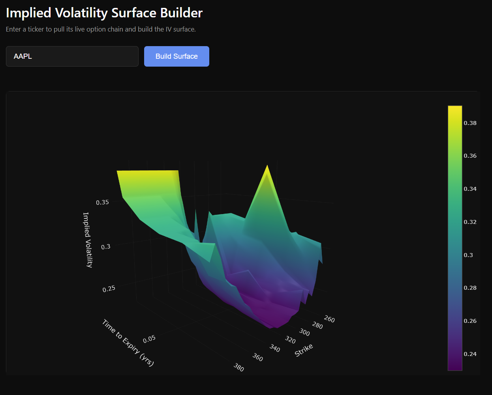
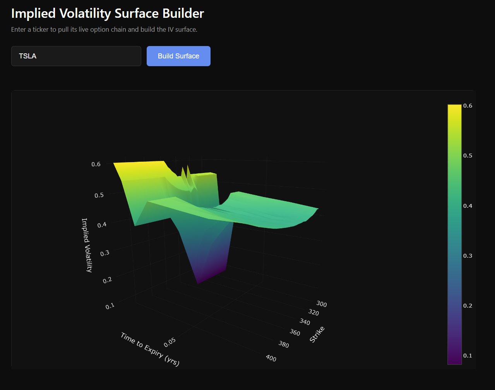

# Implied Volatility Surface Builder

A Flask web app that pulls a stock's live option chain, backs out implied volatility for every contract using a Newton-Raphson solver built on the Black-Scholes model, and renders the result as an interactive 3D surface.




## What it does

1. Enter a ticker (e.g. `AAPL`, `TSLA`, `SPY`)
2. Pulls the live option chain across multiple expiries via `yfinance`
3. Filters out illiquid contracts (low open interest, extreme strikes)
4. Solves for implied volatility on every remaining contract using Newton-Raphson
5. Reshapes the results into a strike × time-to-expiry grid
6. Renders it as an interactive Plotly 3D surface, right in the browser

The resulting surface reveals real market structure — the **volatility smile/skew** where deep in/out-of-the-money options carry higher implied volatility than near-the-money ones.

## Tech stack

- **Backend:** Flask, Python
- **Data:** yfinance (live option chains)
- **Math:** NumPy, SciPy (Black-Scholes pricing, vega, Newton-Raphson IV solver)
- **Data wrangling:** pandas (pivot tables, interpolation)
- **Frontend:** Plotly.js (interactive 3D surface), vanilla JS

## How it works

- `data_fetcher.py` — pulls option chains across expiries, computes time-to-expiry, filters for liquid/near-the-money contracts, returns a flat table of (strike, expiry, market price)
- `iv_solver.py` — Black-Scholes call pricing + vega, and a Newton-Raphson loop that inverts market price into implied volatility
- `app.py` — Flask routes: serves the page, and on `/analyze` runs the full pipeline (fetch → solve IV → pivot into a grid → interpolate gaps → return JSON)
- `templates/index.html` + `static/style.css` — dark-themed frontend that sends the ticker, receives the grid, and renders it with Plotly

## Setup

```bash
git clone https://github.com/aniket2oo6/iv-surface-builder.git
cd iv-surface-builder
pip install -r requirements.txt
python app.py
```

Then open `http://127.0.0.1:5000` and enter a ticker.

## Notes

- Works best with liquid, actively-traded tickers (AAPL, TSLA, MSFT, NVDA, QQQ). Very high-frequency tickers with many same-week expiries (e.g. SPY) can produce a compressed time axis — a planned improvement is smarter expiry sampling.
- Illiquid contracts (low open interest, wide bid-ask spreads) are filtered out, since they produce unstable/unreliable IV estimates when inverted through Newton-Raphson.

## Related projects

Part of an ongoing quant finance portfolio — see also the Options Pricing Calculator (Black-Scholes + Greeks) and Monte Carlo Stock Price Simulator.
